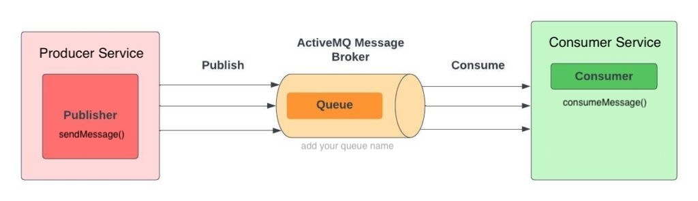

# Spring Boot ActiveMQ Microservices


This repository demonstrates a microservices architecture using Spring Boot and ActiveMQ for message-driven
communication. It provides a simple example of how to integrate ActiveMQ with Spring Boot to enable
asynchronous messaging between services.

The project consists of multiple Spring Boot microservices that communicate via ActiveMQ, a robust message
broker. The services showcase producer-consumer patterns, where one service sends messages to a queue,
and another consumes them for processing.

## Features
 
- **Producer Service**: Sends messages to an ActiveMQ queue.
- **Consumer Service**: Listens to the queue and processes incoming messages.
- **ActiveMQ Integration**: Configured for reliable message delivery.
- **Eureka Discovery Client**: Enables service registration and discovery.
- **Spring Cloud Config**: Centralizes configuration management.



## Configuration

The application is configured using .yaml configuration files for each microservice, defining **ActiveMQ**
connection details, queue names, and other properties. Additionally, Java-based configuration is provided to
programmatically set up ActiveMQ connections and JMS components, as shown in the respective service
configuration classes.

## Getting Started

```shell
    docker-compose -f docker-compose.yml up -d
```

### or

```shell
    docker run -d \
      --name active-mq \
      -e ACTIVEMQ_WEB_USER=admin \
      -e ACTIVEMQ_WEB_PASSWORD=admin \
      -p 61616:61616 \
      -p 8161:8161 \
      -v activemq-data:/opt/activemq/data \
      --network activemq-network \
      --restart unless-stopped \
      apache/activemq-classic:5.17.7
```
